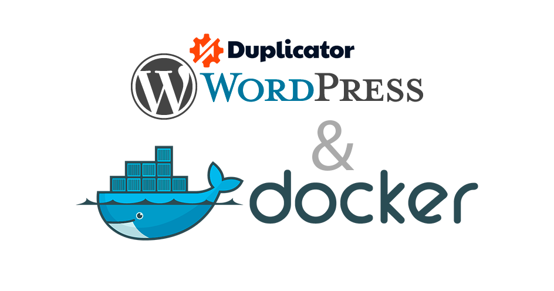
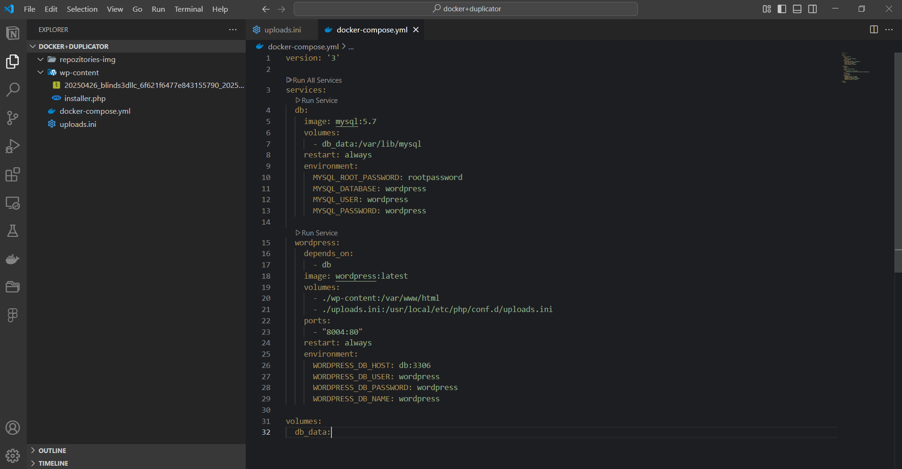
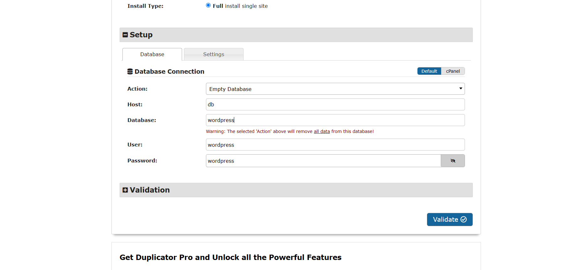

# Starter project for deploying a WordPress website locally using Docker

1) Download this template and place your files that will form Docker into the `wp-content` folder.  

2) You can configure your own settings file according to your needs. Example of the source files:  

3) To start, use the command: `docker-compose up -d`

4) Go to the address: `http://localhost:8003/installer.php`  

The Duplicator installer window will open. Fill in the fields as shown in the example and follow the installer instructions.  

5) If your site is too large, there is a configuration file to adjust the file size limit: `uploads.ini`.

6) After a short time, your site will be installed and become available on your computer. Installation takes about 3–5 minutes.
